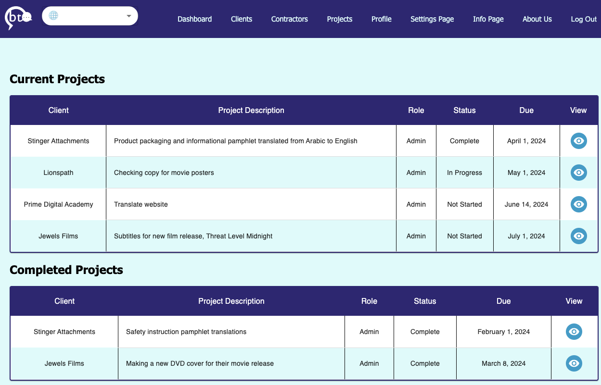
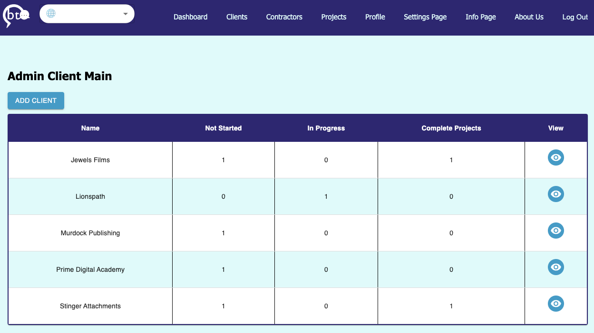
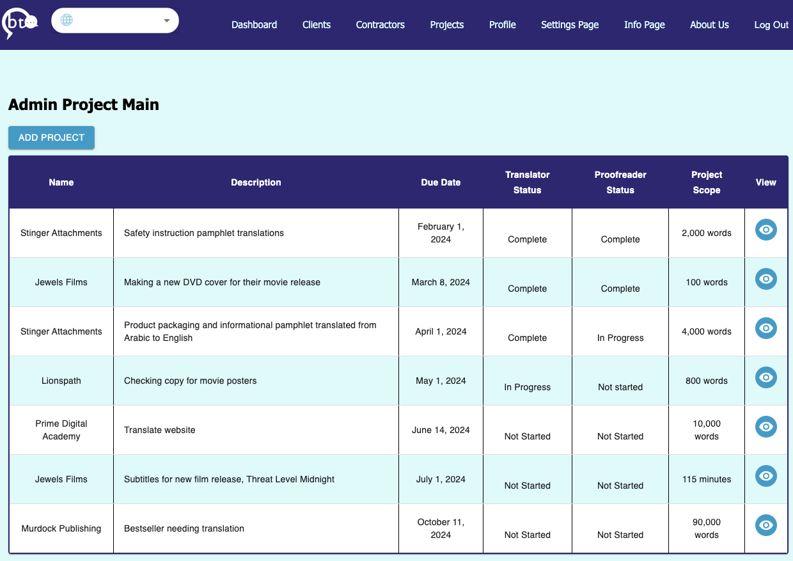
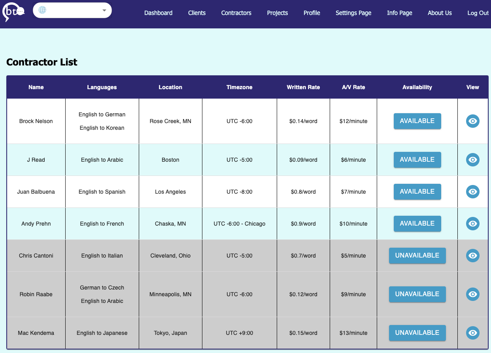

# Borderless Translations
<!-- Table of Contents -->
### Table of Contents
<ul dir="auto">
<li><a href="#description">Description</a></li>
<li><a href="#built-with">Built With</a></li>
<li><a href="#prerequisite">Prerequisites</a></li>
<li><a href="#local-installation-instructions">Local Installation Instructions</a></li>
<li><a href="#usage">Usage</a></li>
<li><a href="#deployment">Deployment Instructions</a></li>
</ul>

### Description
<!-- Description goes here -->
<p dir="auto">
This site provides a central portal where contractors and administrators can share project information. It enables contractors the opportunity to quickly communicate the status of their projects and allows administrators the ability to assess and assign translators at a faster pace. Reducing downtime and inefficiencies in getting projects up, out and completed. 
This site also allows contractors to keep track of their projects and log their progress in order 
to coordinate assignments with Borderless Translations as well as their fellow translators and proofreaders.
</p>


### Built With
<!-- Built With -->
<p> 


</p>


### Getting Started
<!-- Getting Started -->


### Prerequisites
<!-- Prerequisites -->


### Local Installation Instructions

1. Clone repo from github onto your local drive and cd into the folder.
2. `npm install`
3. Create `.env` file in the root directory
4. Add SERVER_SECRET_SESSION and VITE_MAILCHIMP_API_KEY values to `.env`<br>
    Example: (no these are not real)
    ```
    SERVER_SESSION_SECRET=8675309!Ghostbusters#1
    VITE_MAILCHIMP_API_KEY=$UperD00per$3creTC0D3
    ```
5. Create PostgreSQL database on local machine named `borderless_translations`
6. Execute all queries in `database.sql` file to create structure.
7. `npm start`
8. Welcome to your own Borderless Translations portal!!!

### Usage
<!-- Usage -->
Users can log in and see all projects assigned to them. Admin users will see all projects, as well as all clients and contractors.


Admin users can navigate to the clients page to view current clients or add new clients.


Admins can also navigate to the projects page to see all the projects the company is working on, past and present. It is also where new projects can be created.


Admins will be able to view their contractors, see their availability, as well as see more details about each contractor with which projects they have been assigned.



### Deployment Instructions

Login Credentials for Heroku have been provided in the hand off document.

If you need make changes you wish to push to the deployed app, you must login, go into the borderless-translations section, go to the deploy tab, and then manually deploy. You can reconfigure this to redeploy automatically if you wish, which is on the same page.

Environment variables are kept on Heroku in the Settings tab, just click the Reveal Config Vars button

To set up the DB, we used Postico, just plug the information from Heroku into a new favorite. The Information for this can be found in the Resources tab, by clicking the Postgres add on. From there it will bring you to a new page where you will go into the settings tab and click view credentials.

If you'd like to create new users (also a hacky way to change password) you must:

1. Add an environment variable for `SERVER_SESSION_SECRET` with a nice random string for security.
2. Go into the user router
3. Uncomment the route
4. Push changes and redeploy app
5. Register User
6. Comment out the route back in VSCode
7. Push changes
8. Redeploy


